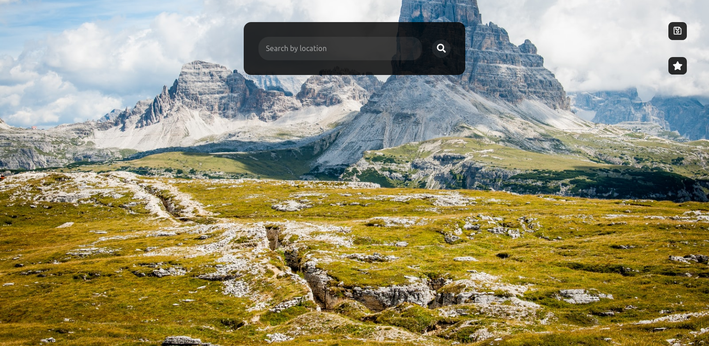
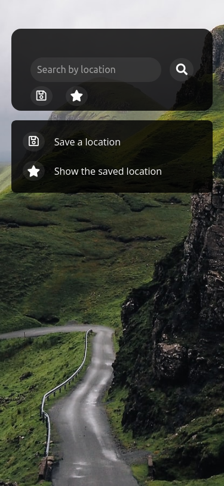
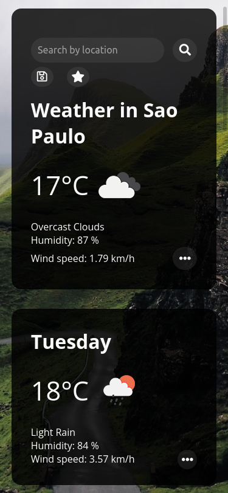

# Weather App

This is a simple weather app wich displays the weather for a given location. It shows the weather for the next 8 days and the temperature for the next 6 hours, humidity, wind speed, what the tempereture feels like, maximum and minimum temperature, UV index, the visibility and pressure.

The user can also save a favourite location and display it without typing the name of the location.

## Table of contents

- [Overview](#overview)
  - [Screenshots](#screenshot)
  - [Live Site](#live-site)
- [My process](#my-process)
  - [Built with](#built-with)
  - [What I learned](#what-i-learned)

## Overview

### Screenshots

### Live Site

- [Live Site](https://airdgo-weather.netlify.app/)

## My process

### Built with

- Semantic HTML5 markup
- SASS
- JavaScript

### What I learned

- How to use JavaScript fetch API to get data from a web server, in this case https://openweathermap.org/.
- How to use async / await functions with fetch.
- How to use JavaScript modules to divide my code so it becomes easier to read and to fix bugs.
